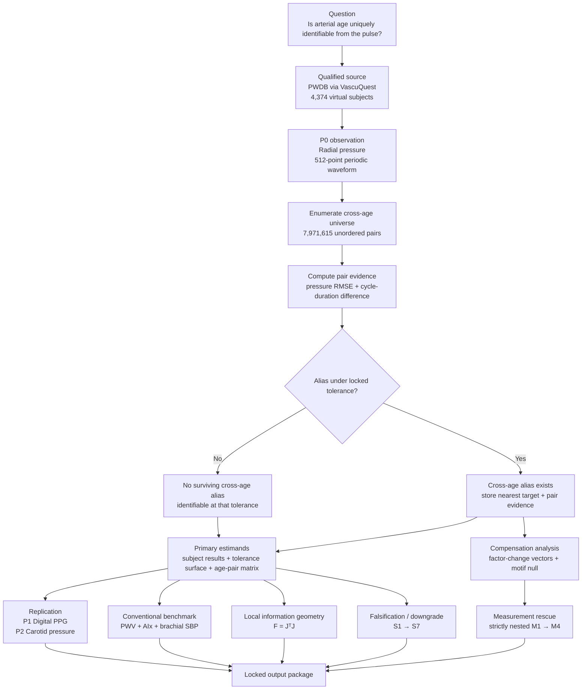
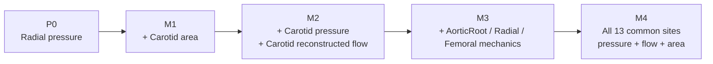

<div align="center">

# VascularAge

### Is Arterial Age Identifiable From the Pulse?

**An exhaustive in-silico trial of physiological aliasing and measurement rescue in 4,374 virtual haemodynamic simulations**

[](phase3/LOCK_MANIFEST.json)
[](#controlled-state)

[](https://doi.org/10.5281/zenodo.3275625)
[](#trial-population)
[](#primary-observation-p0)
[](#computational-contract)
[](https://doi.org/10.5281/zenodo.3275625)

</div>

---

## Scientific objective

**VascularAge** implements **The Locked In-Silico Trial Concept**: a prospectively specified computational experiment asking whether arterial age is uniquely recoverable from arterial pulse phenotypes.

The trial addresses three linked questions:

1. **Physiological aliasing** — can distinct age-conditioned cardiovascular states generate experimentally indistinguishable arterial pulses?
2. **Mechanism** — which controlled physiological compensations create those cross-age aliases?
3. **Measurement rescue** — which additional vascular observations eliminate ambiguity that remains when radial pressure is observed alone?

The governing inverse-problem statement is

$$
(a_1,\boldsymbol{\theta}_1) \neq (a_2,\boldsymbol{\theta}_2)
\quad\text{while}\quad
Y(a_1,\boldsymbol{\theta}_1) \approx Y(a_2,\boldsymbol{\theta}_2).
$$

The project therefore does **not** assume that a pulse-derived age estimate is physiologically unique merely because a predictive model can estimate age accurately.

---

## Controlled state

| Control | Status |
|---|---|
| Canonical trial specification | **Frozen** |
| PWDB / VascuQuest source qualification | **PASS** |
| JAX/XLA computational qualification | **PASS** |
| Evidence map and novelty collision audit | **PASS** |
| Confirmatory protocol | **Cryptographically locked** |
| Real cross-age biological endpoints | **Not executed** |

The authoritative Phase-3 lock package is

```text
89321ec7c7c8909814cd8ab121726c0fcdf0ce5ec2bc44f67795759690b66963
```

The guarded runner is present in the repository, but execution of the real biological trial requires an explicit execution command and the matching lock identifier.

---

## Interactive trial logic

The flowchart below is the conceptual map of the locked in-silico trial. On Mermaid-capable GitHub renderers, selected nodes link directly to the corresponding README sections.



---

## Nomenclature

### Mathematical symbols

| Symbol | Definition | Units / domain |
|---|---|---|
| $\mathcal{A}$ | Locked model-age set $\{25,35,45,55,65,75\}$ | years |
| $i,j$ | Virtual-subject indices | $0,\ldots,4373$ |
| $a_i$ | Model age of subject $i$ | years |
| $\boldsymbol{\xi}_i$ | Standardised factor-state vector of subject $i$ | $(HR,SV,LVET,DIA,PWV,MAP)$ |
| $P_i(\phi)$ | Periodic radial-pressure waveform over phase $\phi$ | mmHg |
| $T_i$ | Active cardiac-cycle duration | ms |
| $e_P$ | Pressure tolerance | mmHg |
| $e_T$ | Cycle-duration tolerance | ms |
| $e_{rel}$ | Relative tolerance for area/flow channels | dimensionless |
| $\Delta P_{ij}$ | Pressure-waveform RMSE | mmHg |
| $\Delta T_{ij}$ | Absolute cycle-duration difference | ms |
| $d_{ij}$ | Locked normalised cross-age pair distance | dimensionless |
| $D_i$ | Minimum cross-age distance for subject $i$ | dimensionless |
| $\Delta\boldsymbol{\xi}$ | Physiological compensation vector | standardised factor levels |
| $Q$ | Reconstructed volumetric flow, $Q=UA$ | source-consistent reconstructed units |
| $J$ | Local finite-difference observation Jacobian | matrix |
| $F$ | Local information / pullback metric, $F=J^\top J$ | matrix |
| $\rho_{rescue}$ | Fraction of P0-aliased subjects rescued by a richer arm | $[0,1]$ |

### Abbreviations

| Abbreviation | Meaning |
|---|---|
| AIx | Augmentation index |
| DIA | Arterial diameter factor |
| HR | Heart rate |
| JAX | Accelerated numerical computing framework used by the confirmatory engine |
| LVET | Left-ventricular ejection time |
| MAP | Mean arterial pressure; PWDB source field `MBP` |
| PPG | Photoplethysmogram |
| PWDB | Pulse Wave DataBase |
| PWV | Pulse-wave velocity |
| RMSE | Root-mean-square error |
| SBP | Systolic blood pressure |
| SV | Stroke volume |
| XLA | Accelerated Linear Algebra compiler backend |

---

## Trial population

The trial uses the canonical **Pulse Wave DataBase (PWDB)**, Zenodo record **3275625**, accessed through the qualified VascuQuest interface.

| Property | Locked value |
|---|---:|
| Virtual haemodynamic simulation instances | **4,374** |
| Model ages | **25, 35, 45, 55, 65, 75 years** |
| States per age | **729** |
| Factorial structure | **$3^6$** |
| Standardised factor levels | **$-1,0,+1$** |
| Controlled factors | **HR, SV, LVET, DIA, PWV, MAP** |
| PWDB source mapping for MAP | **`MBP`** |

Let

$$
\mathcal{A}=\{25,35,45,55,65,75\}.
$$

At each age there are $729=3^6$ controlled states, so

$$
6\times729=4374
$$

virtual subjects are included with equal primary weight.

A PWDB `VirtualSubject` is a **simulation instance, not a patient**. Any alias proportion is therefore a **design prevalence over the complete factorial state space**, not a prevalence estimate in a human population.

---

## Primary observation P0

### Radial-pressure representation

The primary observation is source radial pressure:

```text
site      = Radial
quantity  = pressure
unit      = mmHg
samples   = 512 phase points
```

Each qualified active cycle is mapped periodically to phase $\phi\in[0,1)$ using periodic linear interpolation while preserving absolute pressure and cycle duration.

The primary representation forbids mean subtraction, z-normalisation, peak scaling, pulse-pressure scaling, and subject-specific morphology normalisation.

### Cross-age pair universe

Every state is compared with every state belonging to a different age group. The locked universe is

$$
\binom{6}{2}\,729^2 = 7{,}971{,}615
$$

unordered cross-age pairs spanning all 15 age-pair combinations.

For pair $(i,j)$,

$$
\Delta P_{ij}
=\sqrt{\operatorname{mean}\!\left[(P_i-P_j)^2\right]},
$$

and

$$
\Delta T_{ij}=|T_i-T_j|.
$$

At general tolerances $(e_P,e_T)$, the locked distance is

$$
d_{ij}(e_P,e_T)
=\sqrt{\left(\frac{\Delta P_{ij}}{e_P}\right)^2
+\left(\frac{\Delta T_{ij}}{e_T}\right)^2}.
$$

The reference point is $e_P=5\,\mathrm{mmHg}$ and $e_T=10\,\mathrm{ms}$. A pair is classified as aliased when

$$
d_{ij}\le 1.
$$

The full tolerance surface is

$$
e_P\in\{1,2,3,5,8,10\}\ \mathrm{mmHg},
\qquad
e_T\in\{2,5,10,20\}\ \mathrm{ms},
$$

giving **24 prespecified tolerance points**.

The primary subject-level estimand is

$$
D_i=\min_{j:\,a_j\ne a_i} d(i,j).
$$

When several targets lie within the locked tie tolerance $10^{-6}$, the canonical confirmatory result uses the smallest global target-row index.

---

## Replication arms

Replication tests whether the principal phenomenon is specific to the radial-pressure observation.

| Arm | Observation | Locked role |
|---|---|---|
| **P1** | Digital PPG | Shape-only replication plus duration |
| **P2** | Carotid pressure | Same pressure-distance logic as P0 |

Digital PPG is treated as an arbitrary-unit morphology signal; the trial does not invent a physical amplitude scale for it.

---

## Measurement rescue

Measurement rescue asks: **if P0 is ambiguous, which richer observation set removes that ambiguity?**

The hierarchy is strictly nested:



A source state is rescued in arm $M_k$ when it has at least one P0 reference alias but zero surviving aliases under the richer arm.

For area and reconstructed flow, the locked symmetric relative-RMS discrepancy is

$$
r(x,y)
=\frac{\operatorname{RMS}(x-y)}
{\sqrt{\tfrac12\left[\operatorname{RMS}(x)^2+\operatorname{RMS}(y)^2\right]}}.
$$

The reference relative tolerance is $e_{rel}=0.05$, with

$$
e_{rel}\in\{0.01,0.02,0.05,0.10,0.20\}.
$$

Reconstructed flow obeys

$$
Q=UA
$$

and retains VascuQuest evidence status **RECONSTRUCTED**.

The M4 upper-bound arm uses pressure, reconstructed flow, and luminal area across the 13 qualified common sites: `AorticRoot`, `ThorAorta`, `AbdAorta`, `IliacBif`, `Carotid`, `SupTemporal`, `SupMidCerebral`, `Brachial`, `Radial`, `Digital`, `CommonIliac`, `Femoral`, and `AntTibial`.

---

## Physiological compensation analysis

For a P0-aliased source state and its canonical nearest cross-age target,

$$
\Delta\boldsymbol{\xi}
=\boldsymbol{\xi}_{\text{target}}
-\boldsymbol{\xi}_{\text{source}}.
$$

The vector is retained in locked factor order

$$
(HR,SV,LVET,DIA,PWV,MAP).
$$

The confirmatory mechanism test evaluates recurring compensation motifs using the top 20 motifs and a locked null with **2,000 permutations** and random seed `20260829`.

---

## Conventional benchmark

The full-waveform result is benchmarked against aortic PWV, aortic AIx, and brachial SBP.

The PWV-only alias rule is

$$
\frac{2|x-y|}{|x|+|y|}\le0.05,
$$

with denominator floor $10^{-12}$.

The composite benchmark additionally requires AIx absolute difference $\le5$ percentage points and brachial SBP absolute difference $\le5\,\mathrm{mmHg}$.

A novelty downgrade is triggered if PWV alone nearly reproduces the P0 alias graph according to the locked S5 criteria.

---

## Local information geometry

At the baseline factorial state

$$
\boldsymbol{\xi}=(0,0,0,0,0,0)
$$

within each age stratum, the trial forms a central-difference Jacobian $J$ and computes

$$
F=J^\top J.
$$

Reported quantities are eigenvalues, eigenvectors, condition number, and weakest observable direction. This is a secondary explanatory analysis of local observability; it does not replace the global cross-age alias search.

---

## Falsification and downgrade rules

The confirmatory trial is designed to be able to fail.

| Rule | Consequence |
|---|---|
| **S1** | No major aliasing claim if alias fraction is $<0.01$ at every P0 tolerance point |
| **S2** | No robust aliasing claim if legitimate alternative pressure metrics yield poor alias-set agreement in Phase 5 |
| **S3** | No physiological aliasing claim if the reference result is predominantly a cycle-duration artefact |
| **S4** | No compensation-mechanism claim if motif concentration fails the locked null criterion |
| **S5** | Novelty downgrade if PWV alone essentially reproduces the P0 alias graph |
| **S6** | No measurement-rescue claim if every M1–M4 rescue fraction is $<0.10$ |
| **S7** | Primary claim invalid if forbidden subject-specific normalisation becomes necessary |

The exact machine-readable rules in [`phase3/LOCKED_TRIAL_CONFIG.json`](phase3/LOCKED_TRIAL_CONFIG.json) are authoritative.

---

## Computational contract

The confirmatory engine is locked for JAX/XLA execution with:

| Item | Locked choice |
|---|---|
| Production arithmetic | `float32` |
| CPU reference arithmetic | `float64` |
| JAX x64 production mode | disabled |
| Age-pair block shape | $729\times729$ |
| Pair index dtype | `int32` |
| Pair-component storage | `float32` |
| Tie tolerance | $10^{-6}$ |
| Numerical audit STOP threshold | $|\Delta D_{ref}|>10^{-4}$ or changed alias classification |

Phase 1 qualified the source boundary and synthetic JAX engine externally on Google Colab T4 before the confirmatory protocol was locked.

---

## Data and evidence semantics

VascuQuest is the qualified interface to canonical PWDB record `3275625`.

| Quantity | Evidence class |
|---|---|
| Pressure | **SOURCE** |
| Flow velocity | **SOURCE** |
| Luminal area | **SOURCE** |
| Digital PPG | **SOURCE** |
| Reconstructed flow $Q=UA$ | **RECONSTRUCTED** |

The repository does not rehost PWDB and does not reinterpret virtual simulations as observed human participants.

---

## Evidence and novelty boundary

The novelty boundary was fixed before biological execution using a frozen 889-record evidence map, a 111-record high-relevance collision audit, 50 seeded negative controls, and a targeted current collision audit.

The permitted statement is deliberately narrow:

> Within the mapped evidence and targeted collision audit, no study was identified that explicitly treats arterial age as a global non-unique inverse problem by exhaustively testing whether distinct age-conditioned cardiovascular states can generate observationally indistinguishable arterial pulse phenotypes, mapping the physiological compensations that create those aliases, and quantifying which additional vascular measurements resolve them.

The project does **not** claim to be the first cardiovascular identifiability study, pulse-wave inverse problem, cardiovascular sloppiness study, multimodal identifiability study, vascular-age estimator, or arterial system-identification study.

---

## Protocol integrity

The Phase-3 lock cryptographically binds the canonical scientific protocol, the externally qualified source/engine boundary, the Phase-2 novelty boundary, the complete confirmatory configuration, mathematical primitives, source semantics, guarded execution runner, and required output inventory.

Authoritative lock identifier:

```text
89321ec7c7c8909814cd8ab121726c0fcdf0ce5ec2bc44f67795759690b66963
```

Locked scientific definitions must not be altered after biological outcomes are observed without a disclosed protocol amendment.

---

## Repository map

| Path | Authority |
|---|---|
| [`README.md`](README.md) | Authoritative project overview |
| [`protocol/`](protocol/) | Canonical scientific specification and estimands |
| [`notebooks/01_engine_qualification.ipynb`](notebooks/01_engine_qualification.ipynb) | External Phase-1 qualification evidence |
| [`phase1/`](phase1/) | Source and computational qualification contract |
| [`phase2/`](phase2/) | Evidence map and novelty collision audit |
| [`phase3/ANALYSIS_PLAN.md`](phase3/ANALYSIS_PLAN.md) | Human-readable confirmatory protocol |
| [`phase3/LOCKED_TRIAL_CONFIG.json`](phase3/LOCKED_TRIAL_CONFIG.json) | Machine-readable scientific authority |
| [`phase3/LOCK_MANIFEST.json`](phase3/LOCK_MANIFEST.json) | Cryptographic protocol identity |
| [`phase3/LOCKED_OUTPUT_SCHEMA.json`](phase3/LOCKED_OUTPUT_SCHEMA.json) | Required confirmatory output inventory |
| [`scripts/phase4_execute_locked.py`](scripts/phase4_execute_locked.py) | Guarded confirmatory runner |
| [`src/vascularage/confirmatory.py`](src/vascularage/confirmatory.py) | Frozen mathematical analysis primitives |
| [`src/vascularage/locked_io.py`](src/vascularage/locked_io.py) | Frozen qualified PWDB preparation semantics |

---

## Required confirmatory output package

When the guarded trial is eventually executed, the locked output package requires:

1. `execution_provenance.json`
2. `primary_subject_results.csv`
3. `primary_tolerance_surface.csv`
4. `primary_age_pair_matrix.csv`
5. `primary_pair_components.npz`
6. `replication_summary.csv`
7. `compensation_vectors.csv`
8. `compensation_motifs.csv`
9. `compensation_null_summary.json`
10. `measurement_rescue_summary.csv`
11. `conventional_benchmark.json`
12. `information_geometry.json`
13. `numerical_audit.json`
14. `trial_summary.json`

---

## References

- Charlton PH, et al. **Modeling arterial pulse waves in healthy aging: a database for in silico evaluation of hemodynamics and pulse wave indexes.** *American Journal of Physiology-Heart and Circulatory Physiology* (2019). [doi:10.1152/ajpheart.00218.2019](https://doi.org/10.1152/ajpheart.00218.2019)
- **Pulse Wave DataBase (PWDB)** — [doi:10.5281/zenodo.3275625](https://doi.org/10.5281/zenodo.3275625)
- **VascuQuest** — <https://github.com/KNOWDYN/VascuQuest>

---

## Interpretation discipline

Until the guarded confirmatory execution is explicitly performed, this repository contains **no substantive biological result** about cross-age alias prevalence, dominant compensation motifs, measurement-rescue effectiveness, age-specific ambiguity, or superiority over conventional vascular-age markers.
