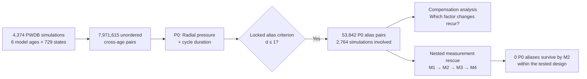

<div align="center">

# VascularAge

### Is arterial age identifiable from the pulse?

**A complete cross-age comparison of 4,374 virtual haemodynamic states testing when different model ages produce observationally indistinguishable arterial pulses—and which additional measurements resolve that ambiguity.**

[](#trial-status)
[](phase3/LOCK_MANIFEST.json)
[](https://doi.org/10.5281/zenodo.22166095)
[](https://doi.org/10.5281/zenodo.3275625)

</div>

---

## What this study asks

An age-prediction model can perform well on average without proving that age is uniquely recoverable from the measurement it uses. VascularAge tests the stricter inverse question: **can cardiovascular states belonging to different model-age groups produce arterial pulse observations that are too similar to distinguish under a prespecified measurement criterion?**

The study asks three linked questions:

1. Can different age-conditioned cardiovascular states generate observationally indistinguishable arterial pulses?
2. Which physiological factor changes occur most often among the nearest cross-age aliases?
3. Which additional vascular measurements remove ambiguity left by radial pressure alone?

A **cross-age pulse alias** is a pair of simulations from different model-age groups whose observations satisfy the prospectively specified alias criterion. In this repository, *identifiability* means whether the underlying model age is uniquely distinguishable from the specified observation within the tested factorial state space.

## Main finding

Within the prespecified PWDB factorial design and the locked P0 reference criterion, **radial pressure alone did not uniquely separate model ages**. Of **7,971,615** unordered cross-age pairs, **53,842** satisfied the P0 alias criterion, involving **2,764 of 4,374 simulations (63.2%)**.

Adding the haemodynamic measurements specified by the nested rescue analysis progressively reduced this ambiguity. **No P0 reference aliases survived the M2 observation set** within the tested factorial population; the richer M3 and M4 arms retained that complete rescue.

This is an **in-silico identifiability study**, not a clinical diagnostic study. It does not establish biological vascular age as ground truth, diagnostic performance in patients, or the prevalence of pulse ambiguity in human populations.

---

## Study at a glance

| Question | VascularAge |
|---|---|
| Experimental system | Pulse Wave DataBase (PWDB) virtual haemodynamic simulations |
| Virtual simulations | **4,374** |
| Model ages | **25, 35, 45, 55, 65, 75 years** |
| States per age | **729** |
| Factorial design | **$3^6$** states per age |
| Varied factors | Heart rate, stroke volume, LV ejection time, arterial diameter, pulse-wave velocity, mean arterial pressure |
| Cross-age comparisons | **7,971,615** unordered pairs |
| Primary observation (P0) | Absolute Radial pressure waveform + active-cycle duration |
| Locked P0 reference criterion | **5 mmHg** pressure discrepancy and **10 ms** duration discrepancy |
| P0 alias pairs | **53,842** |
| Simulations participating in at least one P0 alias | **2,764 / 4,374 (63.2%)** |
| First arm with zero surviving P0 aliases | **M2** |
| Human participants | **None** |
| Clinical diagnostic performance tested | **No** |
| Executed evidence archive | [Zenodo v1.0.0](https://doi.org/10.5281/zenodo.22166095) |

A PWDB "virtual subject" is a simulation instance, not a patient. Reported alias fractions are therefore **design prevalences over this complete factorial state space**, not estimates of prevalence in a human population.

---

## How the trial works



The primary search compares every unordered pair belonging to different model ages. Pairs classified as P0 aliases are then used for the physiological-compensation analysis and become the starting set for the strictly nested measurement-rescue analysis.

---

## What the results mean — and what they do not

| Supported by this trial | Not established by this trial |
|---|---|
| Different model-age states can satisfy the locked observational-alias criterion. | The prevalence of pulse ambiguity in human populations. |
| Radial pressure alone leaves substantial ambiguity inside the specified PWDB factorial state space. | Clinical diagnostic accuracy or clinical utility. |
| Independent Digital-PPG and Carotid-pressure replication arms also contain cross-age aliases. | A claim that every pulse-based age estimator must fail. |
| Additional haemodynamic measurements reduce the locked P0 ambiguity; M2 eliminates all P0 reference aliases in this design. | Universal identifiability from M2 measurements outside this model, parameter space, operators, or tolerances. |
| The reported result passes the prospectively specified robustness and tie-sensitivity checks described below. | "Biological vascular age" as an independently established ground-truth quantity. |

The project's novelty claim remains bounded by [`phase2/NOVELTY_STATEMENT.md`](phase2/NOVELTY_STATEMENT.md). This README does not broaden that claim.

---

## Trial status

The computational study is **complete**. Qualification, evidence mapping, prospective protocol lock, confirmatory execution, robustness analysis, and the final tie-sensitivity closure have been executed and audited.

| Stage | Status |
|---|---|
| Source / engine qualification | **PASS** |
| Evidence map and novelty collision audit | **PASS** |
| Prospective confirmatory protocol | **LOCKED** |
| Phase 4 confirmatory trial | **EXECUTED** |
| Amendment 001 | **EXECUTED** |
| Phase 5 S2 robustness | **PASS** |
| Phase 5B tie-sensitivity closure | **PASS** |
| Computational study | **COMPLETE** |

---

## Trial design

### Virtual population

The study uses the canonical Pulse Wave DataBase (PWDB), Zenodo record [`3275625`](https://doi.org/10.5281/zenodo.3275625), through the qualified data interface.

Each model age contains the complete $3^6 = 729$ combination set of six controlled factors in the locked order:

`HR, SV, LVET, DIA, PWV, MAP`

corresponding to heart rate, stroke volume, left-ventricular ejection time, arterial diameter, pulse-wave velocity, and mean arterial pressure.

Across six model ages, this gives $6 \times 729 = 4,374$ simulations. The primary comparison enumerates all 15 unordered age-pair Cartesian products, giving **7,971,615 unordered cross-age pairs**.

### Primary observation P0

P0 is **absolute Radial pressure in mmHg**, periodically resampled to 512 phase points while retaining the active-cycle duration derived from Radial pressure.

For simulations $i$ and $j$:

$$
\Delta_P(i,j)=\operatorname{RMSE}(P_i,P_j), \qquad
\Delta_T(i,j)=|T_i-T_j|.
$$

The normalized pair distance is

$$
d(i,j)=\sqrt{
\left(\frac{\Delta_P(i,j)}{e_P}\right)^2+
\left(\frac{\Delta_T(i,j)}{e_T}\right)^2
}.
$$

At the locked reference operating point,

$$
e_P=5\ \mathrm{mmHg}, \qquad e_T=10\ \mathrm{ms},
$$

and a pair is classified as a P0 alias when

$$
d(i,j)\le 1.
$$

The prospective P0 tolerance surface contains six pressure tolerances and four duration tolerances, for **24 locked operating points**. Primary processing forbids mean subtraction, z-normalisation, peak scaling, pulse-pressure scaling, and subject-specific morphology normalisation.

### Replication observations

Two additional observation arms test whether the cross-age ambiguity is specific to Radial pressure:

| Arm | Observation | Locked comparison |
|---|---|---|
| **P1** | Digital photoplethysmogram (PPG) | Shape-only waveform comparison plus the locked P0 duration term |
| **P2** | Carotid pressure | Same pressure/duration operator as P0 |

### Nested measurement rescue

Measurement rescue starts **only from P0 reference aliases**. Each richer arm is evaluated only among pairs surviving the preceding arm.

| Arm | Additional measurements beyond P0 |
|---|---|
| **M1** | Carotid luminal area |
| **M2** | Carotid luminal area + Carotid pressure + reconstructed Carotid flow $Q=UA$ |
| **M3** | M2 + pressure/flow/area at Aortic Root and Femoral + flow/area at Radial |
| **M4** | Pressure, reconstructed flow and luminal area across all 13 common sites, excluding duplicate Radial pressure already present in P0 |

Added pressure uses the locked 5 mmHg reference tolerance. Added area and reconstructed-flow observations use the locked symmetric relative-RMS criterion at reference tolerance 0.05.

The local information/pullback-geometry analysis was prospectively specified as **secondary explanatory work**. Its outputs are preserved in the executed evidence and are not used to establish the primary aliasing result.

---

## Main results

### Cross-age aliasing and replication

| Arm | Pair aliases | Simulations with at least one alias | Alias-simulation fraction |
|---|---:|---:|---:|
| **P0 Radial pressure** | **53,842** | **2,764** | **63.2%** |
| **P1 Digital PPG** | **298,547** | — | **65.9%** |
| **P2 Carotid pressure** | **98,311** | — | **65.1%** |

All three observation arms therefore contained cross-age aliases under their respective locked reference operators. The P1 and P2 arms are replications of the existence of cross-age observational ambiguity, not estimates of human prevalence.

### Measurement rescue

| Arm | Surviving P0 alias pairs | Simulations still aliased | Rescue fraction among P0-aliased simulations |
|---|---:|---:|---:|
| **M1** | 6,838 | 1,580 | **42.8%** |
| **M2** | 0 | 0 | **100.0%** |
| **M3** | 0 | 0 | **100.0%** |
| **M4** | 0 | 0 | **100.0%** |

Within this factorial in-silico design, the M2 observation set eliminated every P0 reference alias. Because the arms are strictly nested, M3 and M4 retained that zero-survivor result.

### Physiological-compensation motifs

For each P0-aliased source simulation, the locked mechanism analysis used its canonical nearest cross-age target and the factor-change vector in the order `(HR, SV, LVET, DIA, PWV, MAP)`.

| Quantity | Result |
|---|---:|
| Distinct compensation motifs | **178** |
| Simulations represented by the 20 most frequent motifs | **1,609 / 2,764** |
| Top-20 motif concentration | **58.2%** |
| Locked permutation-null 95th percentile | **3.36%** |
| Locked permutations | **2,000** |
| S4 no-go | **false** |

This is a structured description of recurring factor changes among nearest cross-age aliases. It does not by itself establish causal physiological mechanisms in humans.

### Conventional haemodynamic benchmark

The prospectively specified conventional comparator used aortic pulse-wave velocity (PWV), augmentation index, and brachial systolic pressure.

| Quantity | Result |
|---|---:|
| PWV-only alias-simulation fraction | **97.7%** |
| Conventional-composite alias-simulation fraction | **95.4%** |
| PWV-only pair-alias Jaccard with P0 | **0.0124** |
| PWV-only subject-level alias-existence agreement with P0 | **0.655** |
| S5 novelty downgrade | **false** |

The high conventional alias fractions did not correspond to close reproduction of the P0 pair-alias structure, so the locked S5 downgrade rule did not fire.

### Phase 5 S2 robustness

The prospectively locked S2 analysis replaced the P0 RMSE pressure discrepancy with matched-scale L1/MAE and $L_\infty$ alternatives while keeping the same duration term and 5 mmHg / 10 ms scales.

| Metric | Alias simulations | Jaccard vs P0 |
|---|---:|---:|
| **P0 / RMSE** | 2,764 | 1.000 |
| **L1 / MAE** | 2,874 | **0.962** |
| **$L_\infty$ / maximum error** | 1,724 | **0.624** |

The locked S2 no-go required **both** alternative Jaccard values to be below 0.50. It did not fire.

**Post-execution interpretation.** For the same pressure-difference vector and matched scales,

$$
\operatorname{MAE}(\Delta P)\le\operatorname{RMSE}(\Delta P)\le\|\Delta P\|_\infty.
$$

Consequently the corresponding alias sets are necessarily nested:

$$
A_{L_\infty}\subseteq A_{P0}\subseteq A_{L1}.
$$

Once the observed P0 prevalence was known, the L1 component could no longer independently make the two-arm AND criterion fail. The $L_\infty$ arm remained independently informative and also exceeded the locked 0.50 Jaccard threshold. No retrospective threshold or adjudication was changed.

### Phase 5B tie-sensitivity closure

Phase 3 required the compensation analysis to be checked over alternative targets lying within $10^{-6}$ of the minimum cross-age distance.

| Quantity | Result |
|---|---:|
| Simulations with co-nearest alternatives | **0 / 4,374** |
| P0-aliased sources with co-nearest alternatives | **0 / 2,764** |
| Maximum co-nearest count | **1** |
| Minimum nearest/second-nearest gap, all simulations | **$1.478\times10^{-5}$** |
| Minimum gap among P0-aliased sources | **$4.977\times10^{-5}$** |
| Co-nearest-sensitive top-20 concentration | **58.2%** |
| Difference from canonical concentration | **0.0** |
| Outcome | **NO_CO_NEAREST_ALTERNATIVES** |

Thus the canonical smallest-index tie rule never resolved an actual tie among simulations entering the compensation analysis.

---

## Amendment 001: why the confirmatory run was amended

The first external Phase-4 execution completed P0 and then stopped at P1 because the implementation required the Digital-PPG raw active-sample count to equal the Radial-pressure raw active-sample count for every simulation. The canonical PWDB source does not satisfy that cross-site equality assumption: valid site-local active supports can differ by one or occasionally two samples.

This was an implementation invariant, not a scientific estimand. **Amendment 001 was adopted after P0 had been observed and before the previously unseen secondary and mechanistic endpoints were executed.** The observed P0 result was therefore disclosed and cryptographically bound before re-execution.

A001 changed only the source-loading rule:

> **No cross-signal raw-length equality is required unless a mathematical operation itself requires aligned source samples.**

Under A001:

- each ordinary waveform is validated on its own source-supported active cycle and independently phase-resampled to 512 points;
- cross-site raw active-count equality is not required;
- the duration coordinate remains defined exclusively by P0 Radial pressure;
- reconstructed flow $Q=UA$ requires local velocity/area support equality because the multiplication is pointwise;
- trimming, padding, forced raw-grid registration, new site-specific duration definitions, and changes to P0 tolerances or normalisation remain forbidden.

Before any previously unseen endpoint could execute, the amended run audited all **52 common-site waveform members** (13 sites × 4 signals), recomputed P0 with the original locked P0 implementation, performed the float64 numerical audit, checksum-verified the original P0 artifacts, and required reproduction of the preserved P0 results.

The P0 reproducibility gate **passed**: the amended run reproduced **53,842** P0 alias pairs and **2,764 / 4,374** P0-aliased simulations before proceeding downstream.

The failed original notebook, successful A001 notebook, original Phase-3 lock, and amendment record are retained as execution provenance. See [`phase4/AMENDMENT_001.md`](phase4/AMENDMENT_001.md) and [`phase4/README.md`](phase4/README.md).

---

## Falsification status

The trial was prospectively designed to permit failure or downgrade. None of the locked S1–S7 no-go or downgrade rules fired in the completed computational study.

| Rule | Purpose | Final status |
|---|---|---|
| **S1** | Major-aliasing claim no-go | Not triggered |
| **S2** | Robust-aliasing claim no-go | Not triggered |
| **S3** | Physiological-aliasing claim no-go | Not triggered |
| **S4** | Compensation-structure no-go | Not triggered |
| **S5** | Novelty downgrade against conventional benchmark | Not triggered |
| **S6** | Measurement-rescue claim no-go | Not triggered |
| **S7** | Invalidating need for forbidden primary normalisation | Not triggered |

The exact operational definitions are preserved in [`phase3/LOCKED_TRIAL_CONFIG.json`](phase3/LOCKED_TRIAL_CONFIG.json) and the Phase-3 lock package. The S2 post-execution mathematical interpretation above does not alter its prospectively locked adjudication.

---

## Data and executed evidence

VascularAge has two distinct external research objects: the **source simulation dataset** and the **executed VascularAge evidence archive**. They serve different roles and should not be conflated.

### Source simulation data

**Pulse Wave DataBase (PWDB)**  
Zenodo DOI: [`10.5281/zenodo.3275625`](https://doi.org/10.5281/zenodo.3275625)

PWDB provides the 4,374 virtual haemodynamic simulations analysed by the trial.

### VascularAge executed evidence

**VascularAge: Executed Evidence From the In-Silico Trial of Cross-Age Pulse Aliasing and Measurement Rescue**  
Creator: **Khalid Saqr** ([ORCID 0000-0002-3058-2705](https://orcid.org/0000-0002-3058-2705))  
Published: **29 August 2026**  
Version: **1.0.0**  
Zenodo DOI: [`10.5281/zenodo.22166095`](https://doi.org/10.5281/zenodo.22166095)

The deposit preserves the executed scientific evidence from:

1. **Phase 4 Amendment 001** — confirmatory cross-age pulse-aliasing analysis;
2. **Phase 5 S2** — prespecified robustness analysis with alternative waveform discrepancy definitions; and
3. **Phase 5B** — prespecified tie-sensitivity closure of the compensation analysis.

| Archive property | Value |
|---|---|
| Frozen upload | `VascularAge_Executed_Evidence_v1.0.0.tar.gz` |
| Size | **84.3 MB** |
| Original executed-evidence files | **38** |
| Archive SHA-256 | `3489198c46e7c0217aece7ab534b8786082f03b4658397fff1b080ac3b6db92e` |
| Publication-base repository commit | `f373bee555bce39b5860c47c923dc6c825a4ef90` |

No scientific output was regenerated, normalised, reformatted, or edited during archival packaging. The original per-phase evidence files were preserved byte-for-byte, their bundle hashes were revalidated before packaging, and the completed archive was extracted and revalidated against its root checksum manifest.

**The repository defines and validates the analysis; Zenodo preserves the executed evidence.**

---

## Reproducibility and provenance

The repository retains the prospectively locked scientific definitions, guarded execution code, deterministic validators, tests, and executed notebooks. Large executed-evidence files are archived on Zenodo rather than duplicated in Git.

### Scientific lock identities

| Scientific package | SHA-256 lock |
|---|---|
| Phase 3 protocol | `89321ec7c7c8909814cd8ab121726c0fcdf0ce5ec2bc44f67795759690b66963` |
| Phase 4 Amendment 001 | `1a87a71b638ae4311a1fc4d71c07b4a4a7760f0087a8a25f534774c36bccf7d7` |
| Phase 5 S2 | `97d831b3b3770dddcec9101f3095ecd92d190c4c9f4a1c17e67c2a6c3b8dfb05` |
| Phase 5B tie-sensitivity | `6b9f11bf0c662c8263e531b0440882881d79b5ab70aaa4aaeffd4e4a69d741c2` |

Key preserved Phase-4 evidence identities include:

```text
primary_pair_components.npz
f4e411dab367bf758466c89d65dcf261b2518af6fbd718b83eae9c2e021184bf

primary_subject_results.csv
aa20eb842496e8ad3bb85232bafff18ba4724903f76f1e79e6b1ff3da036829a
```

Phase 5B independently reverified the preserved Phase-4 artifacts before closing the final tie-sensitivity obligation.

The executed notebooks in [`notebooks/`](notebooks/) are retained as execution provenance. The scientific definitions live in the locked JSON/Markdown packages and Python analysis modules rather than in notebook outputs.

---

## Validation

Local repository validation:

```bash
python -m pip install -e ".[test]" "jax[cpu]"
pytest -q
python scripts/validate_phase1_static.py
python scripts/phase2_validate.py
python scripts/phase3_validate.py
python scripts/validate_phase4_amendment001.py
python scripts/validate_phase5_s2.py
python scripts/validate_phase5b.py
```

GitHub Actions performs the same repository-wide validation and verifies that guarded execution entry points cannot run their biological/evidence endpoints without the explicit locked execution flags.

---

## Repository structure

```text
VascularAge/
├── phase1/      qualification contract and audit
├── phase2/      evidence map, screening and novelty collision audit
├── phase3/      prospectively locked confirmatory protocol
├── phase4/      Amendment 001 and confirmatory execution contract
├── phase5/      S2 robustness lock and post-execution audit
├── phase5b/     final tie-sensitivity lock and audit
├── notebooks/   executed Colab notebooks retained as provenance
├── src/         scientific analysis primitives
├── scripts/     guarded execution and validation entry points
├── tests/       deterministic unit / known-answer tests
└── .github/     continuous validation
```

Development and execution artifacts are retained only where they contribute to protocol provenance, reproducibility, or auditability.

---

## Citation

### Executed VascularAge evidence

> Saqr, K. (2026). *VascularAge: Executed Evidence From the In-Silico Trial of Cross-Age Pulse Aliasing and Measurement Rescue* (Version 1.0.0) [Dataset]. Zenodo. https://doi.org/10.5281/zenodo.22166095

When analysing, reproducing, or referring specifically to the archived executed results, cite the versioned Zenodo dataset above.

### Computational trial record

For the prospective protocol, implementation, validators, and execution provenance, reference this repository and the relevant commit or lock identity. The Zenodo v1.0.0 evidence archive is tied to publication-base commit:

`f373bee555bce39b5860c47c923dc6c825a4ef90`

### Source simulation dataset

Pulse Wave DataBase (PWDB), Zenodo DOI: [`10.5281/zenodo.3275625`](https://doi.org/10.5281/zenodo.3275625).

---

## Scope

VascularAge tests **model-age identifiability and measurement ambiguity inside a specified in-silico factorial cardiovascular system**. The completed computational study supports claims within that defined system and its locked observation operators, tolerances, and robustness checks; it does not convert those results into claims of clinical diagnostic performance or human-population prevalence.
